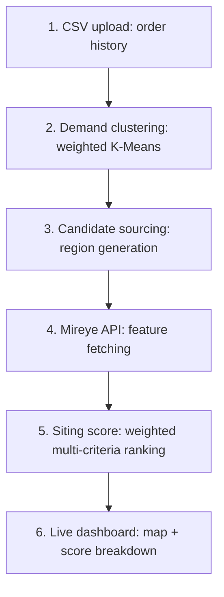

# Anchorpoint

**Warehouse network siting tool for mid-market D2C brands, built on the [Mireye Earth API](https://docs.mireye.ai).**

Anchorpoint turns a brand's historical order data into a ranked, cited shortlist of warehouse sites — scored on real transport, utility, buildability, and hazard data, with every value traced back to its federal source.

`Python` · `FastAPI` · `React` · `TypeScript` · `Tailwind CSS` · `Leaflet.js` · `WebSockets`

---

## Table of contents

- [The problem](#the-problem)
- [The solution](#the-solution)
- [Pipeline architecture](#pipeline-architecture)
- [Why Mireye](#why-mireye)
- [Where the data excels, and where it falls short](#where-the-data-excels-and-where-it-falls-short)
- [Getting started](#getting-started)

---

## The problem

Choosing where to build a fulfillment center is slow and expensive at exactly the company size that can least afford either:

- **Consultant bottlenecks.** Compiling zoning, hazard, utility, and transport data from disparate government sources (FEMA, USGS, EPA, county assessors) normally requires a GIS analyst or a consulting engagement — priced and staffed for enterprise, not a 40-person logistics team.
- **Disconnected data.** Standard mapping tools give routing directions but nothing about the physical characteristics of land itself — parcel size, electrical proximity, grading difficulty, flood exposure.
- **Static decisions.** Without a live pipeline, teams can't ask "what if we weighted power access higher than highway access?" and see the answer — every re-analysis is another manual round-trip.

## The solution

Anchorpoint is a self-serve dashboard where a logistics team can:

- **Ingest historical demand** — upload a CSV of customer shipping orders.
- **Locate demand centers** — cluster order geography into candidate regions.
- **Score candidate sites** — query Mireye for parcel, utility, hazard, and accessibility data around each region.
- **Rank by business priorities** — adjust weighting sliders (e.g. electrical grid access for cold storage vs. highway access for rapid delivery) and watch the ranking update live.

## Pipeline architecture



### 1 · Demand ingestion
The user uploads an order CSV (customer location as ZIP or raw coordinates, order count, revenue). Rows without coordinates are geocoded via the free US Census Geocoding API. Each order is converted to a weighted demand point:

```
weight = order_count + (revenue / 50)
```

### 2 · Demand clustering
Weighted K-Means over the demand points isolates `k` candidate regional hubs — pure clustering math, no Mireye dependency.

### 3 · Candidate sourcing
For each candidate region, generates raw candidate coordinates within a radial buffer around the centroid. (Mireye is not a parcel-search service, so a production version of this step would source real available parcels from a commercial real estate feed or county assessor data — see [limitations](#where-the-data-excels-and-where-it-falls-short) below.)

### 4 · Mireye site attribute enrichment
For each candidate coordinate, calls Mireye's `POST /v1/fetch` across five dimensions:

| Dimension | Fields |
|---|---|
| **Transport** | Distance to nearest major road, roads within 500m, distance to nearest rail line |
| **Power** | Distance to nearest transmission line, substation proximity, line voltage (kV) |
| **Buildability** | Parcel area (m²), zoning classification, developable acreage proxy, grading difficulty |
| **Context** | Housing unit density, distance to nearest urban center |
| **Hazard** | Wildfire annual frequency, floodplain intersection, seismic PGA, design wind speed |

### 5 · Multi-criteria scoring
Each metric is normalized to `[0.0, 1.0]`. User-adjustable weight vectors (from frontend sliders) combine into a composite score per site:

```
final_score = Σ (dimension_weight × dimension_score)
```

Fields missing from a Mireye response (surfaced in its `partial_failures` array) are excluded from that site's score — never defaulted to zero or treated as risk-negative. Sites falling below a data-completeness floor are flagged "insufficient data to rank" rather than assigned a misleadingly confident score.

## Why Mireye

1. **One API instead of a dozen government portals.** Retrieving electrical grid data, zoning codes, and seismic risk normally means separate calls to separate state/county/federal systems. Mireye consolidates this into a single REST schema across terrain, land cover, built environment, utilities, parcels, climate, and hazard layers.
2. **Provenance-tagged, not just returned.** Every value carries its source (FEMA, USGS, NLCD, etc.), a source URL, a fetch timestamp, and a confidence bucket — auditability that matters for a $1–2M facility decision. Anchorpoint surfaces this directly to the user via a citation drill-down on every scored site.
3. **Point-level queries, no shapefile parsing.** Coordinates in, structured JSON out — no GeoJSON/shapefile handling required to get parcel- and point-level attributes.

## Where the data excels, and where it falls short

### Excels
- **Utility/infrastructure accuracy.** Transmission line and substation proximity data is detailed and otherwise hard to source outside specialized utility maps.
- **Speed.** Fetching many geospatial attributes per coordinate completes fast enough to support rapid, iterative siting simulations rather than a single static report.

### Falls short

| Limitation | Why it matters here | Possible fix |
|---|---|---|
| **Straight-line, not drive-time, distance.** `nearest_major_road_distance_m` is Euclidean, not routed. A highway can be 100m away with the nearest on-ramp five miles off. | Supply-chain siting cares about actual travel time and accessibility, not radius. | Pair Mireye with a routing engine (OSRM, Valhalla) for a true drive-time layer, or a future Mireye field exposing routed/isochrone distance. |
| **Non-standardized zoning codes.** `parcel_zoning` returns raw local codes (`M-1`, `IG`, etc.), which vary by municipality with no shared taxonomy. | Can't programmatically check "is fulfillment-center use allowed here" without a manual per-county reference table. | A standardized zoning category field (Commercial / Industrial / Agricultural / Residential) alongside the raw local code. |
| **Historical averages, not forward-looking risk.** `wildfire_annual_frequency` and similar hazard fields are historical averages, not climate projections. | A fulfillment center is a 15–30 year capital investment; historical frequency may understate future risk. | Forward-looking projection classes (e.g. risk under 2040/2050 climate scenarios) alongside the historical baseline. |
| **Not a parcel-search service.** Mireye answers questions about a coordinate you already have — it doesn't supply a list of available industrial parcels. | Candidate site generation currently uses a synthetic radial-buffer approach, not real listings. | Integrate a commercial real estate feed (CoStar, LoopNet, Crexi) or county assessor parcel data as a separate, decoupled sourcing layer. |

## Getting started

```bash
# Backend
cd backend
pip install -r requirements.txt
export MIREYE_API_TOKEN="<your token from mireye.com account settings>"
uvicorn app.main:app --reload

# Frontend
cd frontend
npm install
npm run dev
```

A valid `MIREYE_API_TOKEN` is required at startup — there is no offline/mock mode, since the point of this project is to demonstrate real, working calls against live federal-sourced data.
