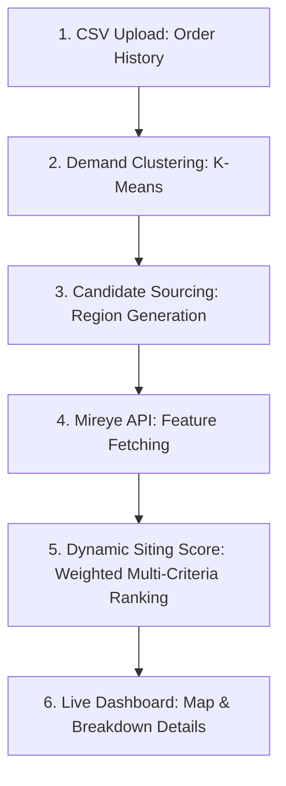

# Anchor Point: Warehouse Network Siting Tool

Anchor Point is an end-to-end web application that optimizes supply chain warehouse placement. It allows users to upload customer demand data, cluster demand hotspots, and score potential warehouse locations on multiple physical, utility, and environmental dimensions using the **Mireye Earth API**.

---

## 1. The Core Concept & Problem Solved

### The Problem
When companies scale their logistics networks, choosing where to build physical fulfillment centers is slow and expensive:
1. **Consultant Bottlenecks:** Companies hire GIS analysts to manually compile zoning, environmental hazard, utility, and transport maps from disparate government databases (FEMA, USGS, EPA, and local counties).
2. **Disconnected Data:** Standard mapping tools (like Google Maps) offer routing details but lack physical land characteristics (e.g., parcel area, electrical line proximity, grading difficulty, and flood risk).
3. **Static Decisions:** Logistics teams cannot dynamically simulate how changes in utility prioritization (e.g., prioritizing power voltage over proximity to highways) alter the optimal warehouse locations.

### The Solution: Anchor Point
Anchor Point provides an automated, self-serve dashboard where logistics managers can:
*   **Ingest Historical Demand:** Upload CSVs of customer shipping orders.
*   **Locate Gravity Centers:** Compute geographical demand centers using K-Means clustering.
*   **Score Candidate Sites:** Query the **Mireye API** for parcel, utility, hazard, and accessibility features around those centers.
*   **Rank by Business Priorities:** Adjust weighting sliders (e.g., prioritizing electrical grid access for cold storage vs. prioritizing highway access for rapid delivery) to find the best candidate site.

---

## 2. Technical Pipeline Architecture

The application is split into a **FastAPI backend** and a **React/TypeScript/Vite frontend**, executing the siting pipeline across five distinct phases:

### Phase 1: Demand Ingestion
*   The user uploads an order CSV containing customer locations (ZIP codes or raw coordinates), order quantities, and revenue.
*   ingestion.py parses the data. If raw coordinates are missing, it queries the free **US Census Geocoding API** to translate ZIP codes into latitude and longitude coordinates.
*   It calculates a weighted demand metric: $\text{weight} = \text{order\_count} + \frac{\text{revenue}}{\$50}$.

### Phase 2: Demand Clustering (Centers of Gravity)
*   [demand.py](file:///Users/mac/Documents/Projects/anchor-point/backend/app/services/demand.py) runs weighted **K-Means clustering** on customer coordinates to isolate $k$ optimal regional hubs. 

### Phase 3: Candidate Sourcing
*   [sourcing.py]   queries geographic points in radial buffer zones surrounding the calculated cluster hubs to identify raw candidate coordinates.

### Phase 4: Mireye Site Attribute Enrichment
*   For each candidate coordinate, the [MireyeClient](file:///Users/mac/Documents/Projects/anchor-point/backend/app/mireye.py#L91) calls the `/v1/fetch` endpoint.
*   It retrieves land features across 5 main dimensions:
    1.  **Transport:** Distance to highway, roads count, distance to railway.
    2.  **Power:** Distance to power transmission lines, substation proximity, line voltage (kV).
    3.  **Buildability:** Land parcel area ($m^2$), zoning rules, proxy developable acreage, terrain grading difficulty.
    4.  **Context:** Housing units density, distance to nearest urban center.
    5.  **Hazard:** Wildfire annual frequency, floodplains, seismic acceleration, wind speeds.

### Phase 5: Multi-Criteria Decision Analysis (MCDA) Scoring
*   The [ScoringService](file:///Users/mac/Documents/Projects/anchor-point/backend/app/services/scoring.py#L314) and [ScoringRankingEngine](file:///Users/mac/Documents/Projects/anchor-point/backend/app/services/ranking.py) compile these metrics.
*   Metrics are normalized between $0.0$ and $1.0$.
*   The engine applies user-customized weight vectors (passed from frontend sliders) to compile a final site composite score:
    $$\text{Final Score} = \sum (\text{Dimension Weight} \times \text{Dimension Score})$$

---

## 3. Why Mireye?

Mireye is the core enabler of this application because it solves three main issues with traditional geographic analysis:

1.  **Single API for Disparate Layers:** Retrieving electrical grid data, zoning codes, and seismic risks normally requires calling separate state/county portals. Mireye consolidates 170+ fields across 7 physical layers into a single REST schema.
2.  **Data Provenance (Provenance-Tagged):** Large logistics decisions require high auditability. Every value returned by Mireye is tagged with its original database source (e.g., FEMA, USGS, National Land Cover Database), which Anchor Point displays to the user in a [CitationDrillDown](file:///Users/mac/Documents/Projects/anchor-point/frontend/src/components/CitationDrillDown.tsx) component.
3.  **Developer Friendly (MCP & REST):** Instead of parsing heavy GeoJSON/Shapefiles, developers can query point-level attributes using simple latitude and longitude inputs.

---

## 4. Critique: Where Mireye Excels & Where It Falls Short

As part of our assessment, we evaluated where the Mireye data works beautifully and where it presents limitations for real-world supply chain decisions:

### Where Mireye Excels
*   **Utility & Infrastructure Accuracy:** The proximity/attributes of transmission lines and substations are incredibly accurate and normally very difficult to find without specialized utility maps.
*   **Speed:** Fetching multiple geospatial vectors for coordinates completes in milliseconds, enabling rapid iteration of siting simulations.

### Where Mireye is Currently Lacking
1.  **Euclidean Distance vs. Real Road Networks:** 
    *   *The Issue:* Mireye returns straight-line distance (`nearest_major_road_distance_m`). In supply chains, physical distance is secondary to **drive-time travel distance** and road accessibility (e.g., a highway might be 100 meters away, but the nearest ramp access is 5 miles away).
    *   *The Fix:* Mireye could integrate routing distances or topology metrics directly, or users must pair Mireye with routing engines (like OSRM or Valhalla).
2.  **Zoning Uniformity:**
    *   *The Issue:* The `parcel_zoning` field returns local county zoning codes (e.g., `M-1`, `IG`). Because every municipality uses unique codes, a developer cannot programmatically check if "Light Industrial Fulfillment" is allowed without manual reference tables.
    *   *The Fix:* Mireye could provide standardized zoning categories (e.g., Commercial, Industrial, Agricultural, Residential) alongside the raw local code.
3.  **Static Annual Risks vs. Long-Term Climate Projections:**
    *   *The Issue:* Wildfire and flood frequencies (`wildfire_annual_frequency`) represent historical averages. Because fulfillment centers are 15-to-30-year capital investments, logistics teams need predictive climate models (e.g., risk levels projected out to 2040 and 2050).
    *   *The Fix:* Introduce historical trend slopes or forward-looking projection classes under the hazard category.
